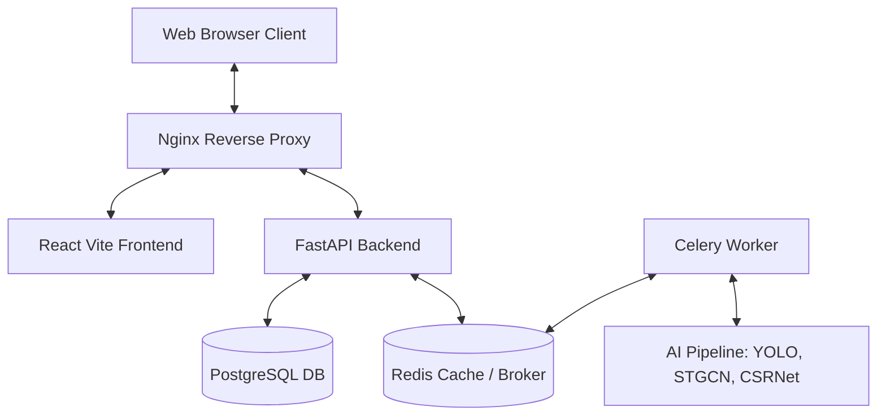

# CrowdShield AI — Real-time Crowd Management and Safety Platform

CrowdShield AI is a state-of-the-art, real-time video analytics and crowd management platform designed to monitor crowd density, predict potential safety hazards, detect abnormal motion, calculate crowd pressure, and coordinate emergency responses.

---

## 🏗️ System Architecture

The application is built as a microservices architecture orchestrating AI pipelines, real-time message streams, and web dashboards:



- **Frontend**: React + TypeScript + Vite + TailwindCSS.
- **Backend API**: FastAPI (Python) for asynchronous endpoints, WebSockets, and file uploads.
- **Task Queue & Broker**: Celery + Redis for asynchronous processing of heavy video AI pipelines.
- **Database**: PostgreSQL for persistent user and alert data.
- **AI Analytics Engine**:
  - **Density Estimation**: CSRNet and Heatmap generation.
  - **Object Detection**: YOLO-based tracking and ByteTrack.
  - **Abnormal Action Forecasting**: STGCN (Spatio-Temporal Graph Convolutional Network).
  - **Pressure & Risk calculation**: Adaptive Crowd Risk Index (CRI) calculators.
- **Reverse Proxy**: Nginx routing requests seamlessly between the Frontend and Backend.

---

## ⚡ Quick Start (Docker Compose)

The easiest way to get the entire stack running is using Docker Compose.

### Prerequisites
Make sure you have [Docker](https://www.docker.com/) and [Docker Compose](https://docs.docker.com/compose/) installed on your system.

### Running the application

1. **Clone the repository** (if not already local):
   ```bash
   git clone https://github.com/nagnitin/CWD.git
   cd CWD
   ```

2. **Start the containers**:
   Navigate to the project root and run:
   ```bash
   docker compose up --build
   ```

3. **Access the application**:
   - **Frontend Dashboard**: [http://localhost](http://localhost) (via Nginx on port 80) or directly at [http://localhost:5173](http://localhost:5173)
   - **Backend API Docs**: [http://localhost:8000/docs](http://localhost:8000/docs) (Swagger UI)

---

## 🔧 Manual Running (Local Development)

If you prefer to run services manually for debugging or active development:

### 1. Requirements & Core services
Ensure you have Python 3.10+ and Node.js 18+ installed. You also need local instances of Redis (port 6379) and PostgreSQL (port 5432) running.

### 2. Run Backend & Celery Worker
1. Navigate to the backend directory:
   ```bash
   cd crowdshield-ai/backend
   ```
2. Create and activate a virtual environment:
   ```bash
   python3 -m venv venv
   source venv/bin/activate
   ```
3. Install dependencies:
   ```bash
   pip install -r requirements.txt
   ```
4. Start the FastAPI server:
   ```bash
   uvicorn app.main:app --reload --port 8000
   ```
5. In a new terminal (with venv active), start the Celery worker:
   ```bash
   celery -A app.workers.celery_app worker --loglevel=info
   ```

### 3. Run Frontend
1. Navigate to the frontend directory:
   ```bash
   cd crowdshield-ai/frontend
   ```
2. Install Node dependencies:
   ```bash
   npm install
   ```
3. Start the Vite dev server:
   ```bash
   npm run dev
   ```
   The frontend will run at [http://localhost:5173](http://localhost:5173).
